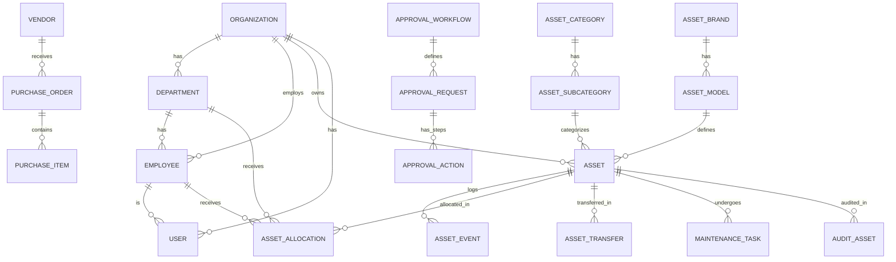

# AssetFlow AI - Database Architecture

## 1. ER Diagram (Mermaid)
Due to the massive scale of the database, this diagram highlights the core relationships.



## 2. Database Architecture Overview
AssetFlow AI is designed as a true Multi-Tenant SaaS platform.
- **Tenant Isolation**: Every tenant data is isolated via `organization_id`. We use logical separation. Every table directly or indirectly linked to an organization has an `organization_id` column for easy Row-Level Security (RLS) and scoped querying.
- **Auditability**: Every table has `created_at`, `updated_at`, `deleted_at`, `created_by`, `updated_by`. A strict `activity_logs` table logs major mutations, and an `asset_events` table acts as an append-only event store for asset lifecycles.
- **Soft Deletes**: Deletions are logical (`deleted_at IS NOT NULL`), avoiding referential integrity errors and preserving historical data.
- **UUIDs**: We use UUIDv4 for all primary keys to ensure global uniqueness, preventing ID enumeration, and allowing distributed data generation.
- **Extensibility**: EAV (Entity-Attribute-Value) anti-patterns are avoided. Instead, `JSONB` is used for dynamic metadata (e.g., `asset_specifications`, `rule_conditions`, OCR extractions).

## 3. Table List
**Core & Auth**: `organizations`, `branches`, `departments`, `designations`, `employees`, `employee_documents`, `users`, `roles`, `permissions`, `role_permissions`, `user_roles`, `sessions`, `refresh_tokens`, `password_reset`, `otp`, `login_history`
**Asset Master**: `asset_categories`, `asset_subcategories`, `asset_brands`, `asset_models`, `asset_status`, `asset_condition`, `assets`, `asset_specifications`, `asset_documents`, `asset_images`, `asset_qr_codes`, `asset_tags`
**Lifecycle**: `asset_events`, `asset_allocations`, `asset_transfers`
**Bookings**: `booking_resources`, `bookings`, `booking_participants`
**Maintenance**: `maintenance_engineers`, `maintenance_requests`, `maintenance_tasks`, `maintenance_logs`, `maintenance_parts`, `maintenance_cost`, `maintenance_documents`
**Vendors & Purchases**: `vendors`, `vendor_contacts`, `vendor_contracts`, `vendor_services`, `vendor_ratings`, `purchase_orders`, `purchase_items`, `purchase_receipts`, `invoices`, `invoice_items`, `payments`
**Warranty & Audit**: `w warranties`, `amc_contracts`, `insurance`, `audit_schedules`, `audit_assets`, `audit_results`, `audit_logs`
**Documents & Comms**: `document_tags`, `documents`, `document_versions`, `notification_templates`, `notification_preferences`, `notifications`
**Workflows & Rules**: `approval_rules`, `approval_workflows`, `approval_steps`, `approval_requests`, `approval_actions`, `business_rules`, `rule_conditions`, `rule_actions`, `rule_logs`
**AI & Analytics**: `asset_health_scores`, `maintenance_predictions`, `recommendations`, `executive_summary_cache`, `ai_queries`, `ai_query_logs`, `recommendation_history`, `activity_logs`

## 17. Recommended Folder Structure for Prisma
If using Prisma as the ORM, splitting the schema (using multi-file preview feature) is highly recommended for a schema this size:

```text
prisma/
├── schema/
│   ├── core.prisma         # Organizations, Branches, Departments, Employees
│   ├── auth.prisma         # Users, Roles, Permissions, Sessions
│   ├── assets.prisma       # Assets, Categories, Brands, Models, QR, Tags
│   ├── lifecycle.prisma    # Events, Allocations, Transfers
│   ├── maintenance.prisma  # Requests, Tasks, Logs
│   ├── procurement.prisma  # Vendors, POs, Invoices, Payments
│   ├── workflows.prisma    # Approvals, Rules Engine
│   ├── audits.prisma       # Schedules, Audit Results
│   └── ai.prisma           # Health scores, Recommendations, AI Logs
└── schema.prisma           # Main file with generator and db blocks
```

## 18. Suggestions for Scaling to Millions of Assets
1. **Table Partitioning**: Partition `asset_events`, `activity_logs`, and `maintenance_logs` by `created_at` (e.g., monthly).
2. **Read Replicas**: Direct all executive dashboard queries and AI batch processing to read replicas.
3. **Connection Pooling**: Use PgBouncer to manage the high number of tenant connections.
4. **JSONB Indexing**: Use GIN indexes on `metadata` in `asset_events` and OCR data to speed up dynamic attribute queries.
5. **Caching Layer**: Redis should cache `executive_summary_cache`, lookup tables (Status, Categories), and user permissions.

## 19. Security Best Practices
- **Row Level Security (RLS)**: Enforce RLS on PostgreSQL side. `ALTER TABLE assets ENABLE ROW LEVEL SECURITY;` and create a policy `USING (organization_id = current_setting('app.current_org_id')::uuid)`.
- **RBAC**: Application must evaluate `role_permissions` before executing mutations.
- **PII Encryption**: Encrypt `employee_documents` and sensitive fields using `pgcrypto` or application-level encryption.
- **Audit Trail**: Triggers should automatically populate `activity_logs` directly at the DB level, preventing application-level bypasses.

## 20. Future IoT Extensions
- **Time-Series Data**: Integrate **TimescaleDB** extension.
- Create `asset_telemetry` table (time-series optimized) to ingest real-time temperature, vibration, or GPS coordinates.
- **Geospatial Tracking**: Add **PostGIS** extension to store `location GEOMETRY(Point, 4326)` in `asset_events` for real-time fleet/asset tracking.

*Note: The complete database schema is generated in the accompanying `assetflow_schema.sql` file.*
